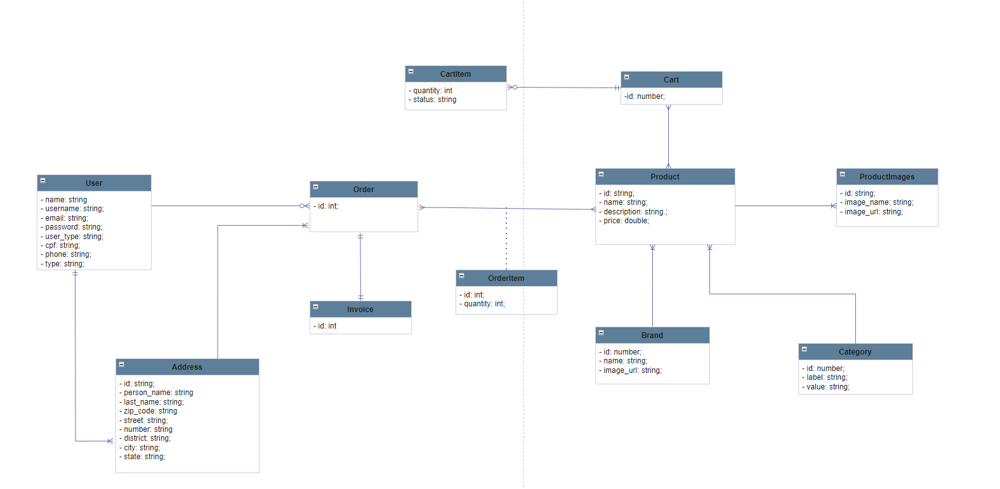

## Caio.ls Ecommerce

## Descrição:
**Caio.ls Ecommerce** é um projeto pessoal para simular um simples e-commerce que vende produtos de tecnologia. Esse projeto foi desenvolvido como parte de um esforço pessoal para expandir e reforçar conhecimentos em tecnologias de backend e frontend, esse projeto oferece uma oportunidade de experimentar e explorar diferentes aspectos do desenvolvimento de software. Cada linha de código, cada recurso implementado e cada desafio superado contribuem para o crescimento e desenvolvimento profissional.

No backend, a ênfase está na construção de uma API sólida e eficiente, capaz de lidar com transações, inserção e pesquisas de produtos, compra e fornecer suporte ao cliente de maneira confiável utilizando tecnologias recentes.

Enquanto isso, no frontend, o foco está na criação de uma interface de usuário envolvente e intuitiva. O design moderno e responsivo é elaborado com o objetivo de proporcionar uma experiência de compra agradável e sem complicações para os usuários. Desde a navegação pelos produtos até o processo de checkout.

## Modelo de Domínio 

## Tecnologias
  - Front-end:
    - React
    - MUI
    - Redux
    - Stripe

  - Back-end:
    - Laravel
    - MySQL
    - Stripe
    - Amazon S3

## Deploy
- O deploy da aplicação foi feito o uso de duas instâncias da Amazon EC2 com o Ubuntu e Apache

## Autor

#### Caio Lucas Silveira de Sousa    
